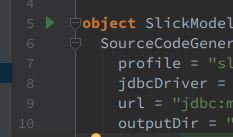

# Scala Hands-on
### 現場で活きるスキルをCRUDアプリケーション開発で学ぶ

---

# 今日のゴール

- Scala + PlayFrameworkでCRUDアプリケーションが作れるようになる
- Scalaの関数型言語としてのエッセンスと、その嬉しさを理解する

---

# 自己紹介タイム

参加者全員でお互いに自己紹介をしましょう👍

---

## 岩松 竜也

- 2015年新卒入社

---

## 田所 駿佑

- 求人検索エンジン「スタンバイ」 プロダクトオーナー見習い
- 2015年新卒入社
- PlayFramework コントリビューター
- 「クローリングハック」(翔泳社) 共著

---

# 自己紹介タイム

参加者全員でお互いに自己紹介をしましょう👍

- お名前を教えてください
- 普段はどんなプログラムを書いていますか？
- 好きな言語はありますか？
- 「今日はこういうことについても聴いてみたい」という要望はありますか？

---

# よろしくお願いします👍

---

# 今回作るアプリケーション
ユーザ情報のCRUDを行う簡単なアプリケーションを作成します。

- ユーザ一覧を表示する
- 新規ユーザ登録を行う
- ユーザ情報を編集する
- ユーザを削除する

---

# 今回作るアプリケーション


---

# プロジェクトの準備(1)
Scalaの基本文法の前に、予めプロジェクトを準備しておきましょう。
ご自身のターミナルで以下のコマンドを実行してください。

```sh
sbt new playframework/play-scala-seed.g8 --branch 2.6.x
```

---

# プロジェクトの準備(2)

プロジェクト名などを聞かれますが、今回はプロジェクト名を`play2-hands-on`とし、他の項目は初期値のままプロジェクトを作成します。

```sh
This template generates a Play Scala project

name [play-scala-seed]: play2-hands-on
organization [com.example]:
play_version [2.6.18]:
sbt_version [1.2.1]:
scalatestplusplay_version [3.1.2]:

Template applied in ./play2-hands-on
```

---

# プロジェクトの準備(3)

作成したプロジェクトのディレクトリに移動し、`sbt run`コマンドを実行します。
プロジェクトの起動に必要な各種ツールやJarがダウンロードされ、アプリケーションが起動されます。

```sh
cd play2-hands-on
sbt run
```

初回の起動にはしばらく時間がかかるので、その間にScalaの基本文法について学びます👍

---

# Scalaのざっくり解説

---

# Scalaの基本文法

---

# 作成したPlayプロジェクトの確認

- ブラウザから`localhost:9000`にアクセスしてみましょう
- `Welcome to Play!` と表示されていれば準備はOKです！

---

# IntelliJにプロジェクトをインポート
IntelliJでPlayプロジェクトを開発するために、まずはプロジェクトをインポートします。
講師と一緒にやってみましょう！

---

# IntelliJとbuild.sbt
- IntelliJはbuild.sbtの設定を元にプロジェクトをインポートします
- build.sbtを編集した場合は、 `Refresh project` でプロジェクトの再インポートを行う必要があります
- または、「Enable auto-import」を選択するとbuild.sbtを変更するたびに自動的に再インポートされるようになります

---

# build.sbtを編集してみよう
試しにbuild.sbtを編集してみましょう。
まずはMySQLのJDBCドライバを依存関係に追加してみます。
build.sbtを下記のように変更してください。

```
libraryDependencies += guice
libraryDependencies += "mysql" % "mysql-connector-java" % "6.0.6" // 追加
libraryDependencies += "org.scalatestplus.play" %% "scalatestplus-play" % "3.1.2" % Test
```

---

# build.sbtを編集してみよう
先程の例は `libraryDependencies +=` が何度も出てきました。これは下記のように書き換えることもできます。

```
libraryDependencies ++= Seq(
  guice,
  "mysql" % "mysql-connector-java" % "6.0.6",
  "org.scalatestplus.play" %% "scalatestplus-play" % "3.1.2" % Test
)

```
@[1](libraryDependencies ++= Seq({依存ライブラリをカンマ区切りで}))

---

# 早速つくりはじめよう

---

# Bootstrapを使う準備(1)
`sbt new` コマンドで作成されたプロジェクトには、デフォルトのレイアウトテンプレートとして `app/views/main.scala.html` が生成されています。ここにBootstrapで使用するCSSとJavaScriptを追加します。

```html
<link rel="stylesheet" media="screen" href="//netdna.bootstrapcdn.com/bootstrap/3.1.1/css/bootstrap-theme.min.css">
<link rel="stylesheet" media="screen" href="//netdna.bootstrapcdn.com/bootstrap/3.1.1/css/bootstrap.min.css">

<script src="//cdnjs.cloudflare.com/ajax/libs/jquery/3.3.1/jquery.min.js"></script>
<script src="//netdna.bootstrapcdn.com/bootstrap/3.1.1/js/bootstrap.min.js"></script>
```

---

# Bootstrapを使う準備(2)
追加したら `localhost:9000` をリロードしてみましょう。 JavaScriptコンソールにエラーが出ているかと思います。
これはPlayが提供している「セキュリティヘッダフィルタ」が、HTTPレスポンスに「同一生成元ではない」リソースを無効にするヘッダ(`Content-Security-Policy`)を付与しているためです。

- [Playのセキュリティヘッダフィルタについてのドキュメント](https://www.playframework.com/documentation/2.6.x/SecurityHeaders)
- [同一生成元ポリシーについて](https://developers.google.com/web/fundamentals/security/csp/)


---

# Bootstrapを使う準備(2)
CDNから配信されるリソースを利用するためには、CDNのドメインを「この配信元は信用できる」というホワイトリストに追加する必要があります。
`conf/application.conf` に下記の一行を追加します。

```
play.filters.headers.contentSecurityPolicy = "script-src 'self' netdna.bootstrapcdn.com cdnjs.cloudflare.com"
```

これでBootstrapを使う準備は完了です。

---

# Controllerの雛形を作る
ではさっそくアプリケーションを作っていきます。まずはControllerの雛形を用意します。

```scala
package controllers

import com.google.inject.Inject
import play.api.mvc.{AbstractController, ControllerComponents}

class UserController @Inject()(controllerComponents: ControllerComponents)
  extends AbstractController(controllerComponents) {

  // 一覧画面の表示
  def list = TODO

  // 編集画面の表示
  def edit(id: Option[Long]) = TODO

  // 登録処理の実行
  def create = TODO

  // 更新処理の実行
  def update = TODO

  // 削除処理の実行
  def delete(id: Long) = TODO
}
```
@[6](PlayFrameworkではControllerをclassとして実装します)
@[6](`@Inject` アノテーションは、Dependency Injectionのためのもの)
@[7](ControllerとなるClassは `AbstractController` を継承します)
@[10](各ActionはScalaのメソッドとして定義します)
@[10](`TODO` はPlayが提供している開発用お役立ちメソッドで、未実装なActionを表します)


---

# ルーティングの雛形を作る

クライアントから送信されたリクエストは、 `conf/routes` の設定に従ってコントローラのメソッドへルーティングされます。
以下の設定を追記します。

```
# Mapping to /user/list
GET     /user/list                  controllers.UserController.list

# Mapping to /user/edit or /user/edit?id=<number>
GET     /user/edit                  controllers.UserController.edit(id: Option[Long] ?= None)

# Mapping to /user/create
POST    /user/create                controllers.UserController.create

# Mapping to /user/update
POST    /user/update                controllers.UserController.update

# Mapping to /user/remove/<number>
POST    /user/remove/:id            controllers.UserController.remove(id: Long)
```
@[1](`#` からはじまる行はコメント)
@[2](`/user/list` へのGETリクエストは `controllers.UserController` クラスの `list` メソッドが処理する)
@[4,5](`id` というクエリパラメータを受け取る。クエリパラメータの型は `Option[Long]` で、デフォルトはNone)


---

# アクセスしてみよう
- `localhost:9000/user/list` にアクセスしてみましょう
- 未実装であることを示す紫色の画面が表示されればOKです
- ここまでのコードは `01_controller-with-todo` ブランチにあります

---

# ここまでのまとめ

---

# MySQLの準備をする(1)
まずはユーザー一覧画面を実装していきましょう。しかしその前にデータベースを用意する必要があります。
今回はMySQLをDockerから使います。プロジェクトのルートディレクトリに下記のような `docker-compose.yml` を用意します。

```yaml
version: '2.0'

services:
    mysql:
        container_name: play2-hands-on_mysql
        image: mysql/mysql-server:5.7
        ports:
            - "3306:3306"
        command: [
        "mysqld",
        "--character-set-server=utf8mb4",
        "--lower_case_table_names=1",
        "--sql_mode=TRADITIONAL",
        "--explicit_defaults_for_timestamp=ON"
        ]
        environment:
            MYSQL_ALLOW_EMPTY_PASSWORD: 1
        volumes:
            - ./mysql/:/docker-entrypoint-initdb.d

```
@[6](dockerhubの公式のMySQLのイメージを使う。versionは5.7)
@[19](MySQLの初回起動時に実行するSQLを指定。この場合、 `mysql/` 以下のSQLを実行する)


---

# MySQLの準備をする(2)
次に、MySQLの初回起動時に実行するSQLを用意します。
下記のような `mysql/init.sql` というSQLファイルを作成します。

```sql
charset utf8mb4;

CREATE USER 'root'@'%' IDENTIFIED BY '';
GRANT ALL PRIVILEGES ON *.* TO 'root'@'%';

CREATE SCHEMA IF NOT EXISTS `play2_hands_on` DEFAULT CHARACTER SET utf8mb4;
USE `play2_hands_on` ;

-- -----------------------------------------------------
-- Table `COMPANY`
-- -----------------------------------------------------
CREATE TABLE IF NOT EXISTS `COMPANY` (
  `COMPANY_ID` BIGINT NOT NULL AUTO_INCREMENT,
  `COMPANY_NAME` VARCHAR(45) NOT NULL,
  PRIMARY KEY (`COMPANY_ID`))
ENGINE = InnoDB;

CREATE UNIQUE INDEX `COMPANY_ID_UNIQUE` ON `COMPANY` (`COMPANY_ID` ASC);


-- -----------------------------------------------------
-- Table `USER`
-- -----------------------------------------------------
CREATE TABLE IF NOT EXISTS `USER` (
  `USER_ID` BIGINT NOT NULL AUTO_INCREMENT,
  `NAME` VARCHAR(45) NOT NULL,
  `EMAIL` VARCHAR(255) NOT NULL,
  `AUTHORITY` VARCHAR(45) NOT NULL,
  `COMPANY_ID` BIGINT NOT NULL,
  PRIMARY KEY (`USER_ID`, `COMPANY_ID`),
  CONSTRAINT `fk_USER_COMPANY`
    FOREIGN KEY (`COMPANY_ID`)
    REFERENCES `COMPANY` (`COMPANY_ID`)
    ON DELETE NO ACTION
    ON UPDATE NO ACTION)
ENGINE = InnoDB;

CREATE UNIQUE INDEX `USER_ID_UNIQUE` ON `USER` (`USER_ID` ASC);

CREATE INDEX `fk_USER_COMPANY_idx` ON `USER` (`COMPANY_ID` ASC);


-- -----------------------------------------------------
-- Data for table `COMPANY`
-- -----------------------------------------------------
START TRANSACTION;
INSERT INTO `COMPANY` (`COMPANY_ID`, `COMPANY_NAME`) VALUES (1, '株式会社AAA');
INSERT INTO `COMPANY` (`COMPANY_ID`, `COMPANY_NAME`) VALUES (2, 'BBBコーポレーション');

COMMIT;

-- -----------------------------------------------------
-- Data for table `USER`
-- -----------------------------------------------------
START TRANSACTION;
INSERT INTO `USER` (`USER_ID`, `NAME`, `EMAIL`, `AUTHORITY`, `COMPANY_ID`) VALUES (1, '田中 太郎', 'tanaka@example.com', 'ADMIN', 1);
INSERT INTO `USER` (`USER_ID`, `NAME`, `EMAIL`, `AUTHORITY`, `COMPANY_ID`) VALUES (2, '鈴木 次郎', 'suzuki@example.com', 'READONLY', 1);
INSERT INTO `USER` (`USER_ID`, `NAME`, `EMAIL`, `AUTHORITY`, `COMPANY_ID`) VALUES (3, '佐藤 三郎', 'sato@example.com', 'EDITOR', 1);
INSERT INTO `USER` (`USER_ID`, `NAME`, `EMAIL`, `AUTHORITY`, `COMPANY_ID`) VALUES (4, '藤原 四郎', 'fujiwara@example.com', 'EDITOR', 2);
INSERT INTO `USER` (`USER_ID`, `NAME`, `EMAIL`, `AUTHORITY`, `COMPANY_ID`) VALUES (5, '野口 五郎', 'noguchi@example.com', 'READONLY', 2);

COMMIT;
```

---

# MySQLの準備をする(3)
下記のようにSQLが叩けるようになったら準備OKです👍

```
mysql -h '127.0.0.1' -uroot -p
Enter password: (Enterを押す)

mysql> select count(*) from play2_hands_on.user;
+----------+
| count(*) |
+----------+
|        5 |
+----------+
1 row in set (0.00 sec)

```

---

# DBアクセスライブラリ「Slick」を導入する
MySQLの準備ができたら、次はDBアクセスライブラリであるSlickを依存関係に追加しましょう。
`build.sbt` のlibraryDependenciesに下記を追加してください。

```
"com.typesafe.play" %% "play-slick" % "3.0.1", // SlickのPlayFrameworkインテグレーション
"com.typesafe.slick" %% "slick-codegen" % "3.2.0", // Modelの自動生成用ライブラリ
```

# Modelの自動生成用コードを用意する
Slickが依存関係に追加されたら、Modelの自動生成用コードを用意してMySQLのスキーマからModelを自動生成します。
`app/generator/SlickModelGen.scala` というファイルを用意し、下記のようにコードを書いていきます。

```scala
object SlickModelGen extends App {
  SourceCodeGenerator.run(
    profile = "slick.jdbc.MySQLProfile",
    jdbcDriver = "com.mysql.cj.jdbc.Driver",
    url = "jdbc:mysql://127.0.0.1:3306/play2_hands_on?useSSL=false&nullNamePatternMatchesAll=true",
    outputDir = "./app",
    pkg = "models",
    user = Some("root"),
    password = Some(""),
    ignoreInvalidDefaults = true
  )
}

```
@[5](`App` トレイトを継承したObjectは単体で実行できます)

___

# Modelを自動生成する
コードが用意できたらModelを自動生成してみましょう。
IntelliJから `SlickModelGen` を実行します。



`app/models/Tables.scala` が生成されたらOKです👍

---

# Option[Long]の謎を解く
`controllers.UserController.edit(id: Option[Long] ?= None)` は、ユーザーの新規登録と編集の両方に使います。

||idが渡されない場合|| 空のフォームを表示|
||idが渡された場合 ||idは編集したいユーザーのもの。ユーザーの情報がすでに埋め込まれたフォームを表示 |

「idはあるかもしれないし、ないかもしれない」をコードで表現する必要があります。

---

# ないときはnull
- Javaでよくあるのは「ないときはnull」
- しかし、これはバグの元
- 呼び出し元はnullチェック必要?必要じゃない?
- NullPointerException

---

# 「あるかもしれないし、ないかもしれない」を表すのがOption
- Optionとは「あるかもしれないし、ないかもしれない」を表す型
- どのように使うのか、なぜうれしいのかを練習問題で感じてみよう！

---

# Option練習問題
【いわまっちゃんお願いします】

---

# 一覧ページを実装する

---

# 機能を追加してみよう
- 一覧ページに、会員種別でフィルターする機能をつける
- 会員種別ごとの人数が見られるページを作ってみよう

そのためにまず「コレクション操作」を学びましょう

---

# コレクション操作に入門する

---

# 会員種別でフィルターしてみよう

---

# 会員種別ごとの人数が見られるページを作ってみよう

---


# build.sbtを編集してみよう
さらに依存関係を追加してみましょう。
jQueryとBootstrapを依存関係に追加します。

```
libraryDependencies ++= Seq(
  guice,
  "mysql" % "mysql-connector-java" % "6.0.6",
  "org.webjars" % "jquery" % "3.3.1-1", // 追加
  "org.webjars" % "bootstrap" % "4.1.3", // 追加
  "org.scalatestplus.play" %% "scalatestplus-play" % "3.1.2" % Test
)

```

# WebJar
- jQueryやBootstrapといったフロントエンドのライブラリをJAR(Java Archive)としてパッケージングして提供している
- フロントエンドのライブラリの依存関係が、Javaのライブラリと同様に管理できるようになる
- SPAとかやるならnpm/yarn使った方がいいかと思うけど、jQuery程度ならこちらの方法が楽
