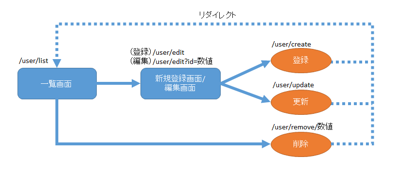
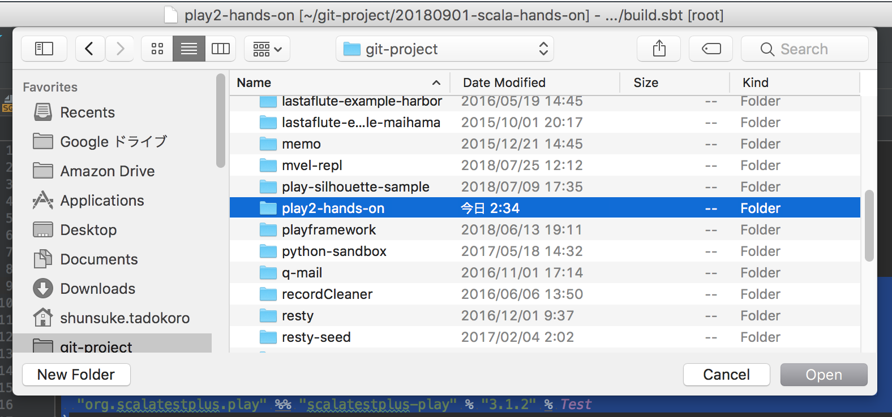
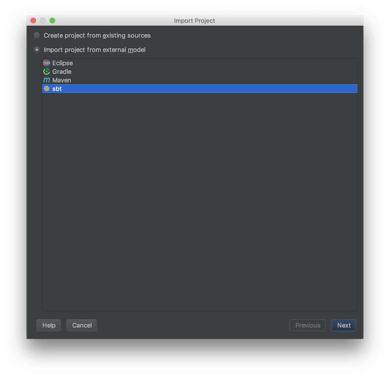
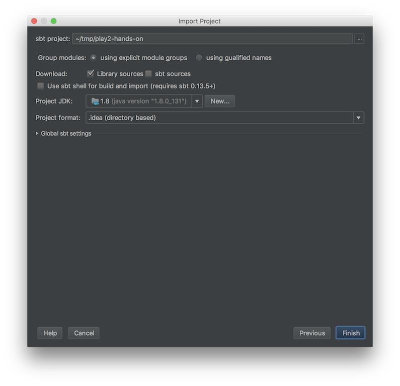
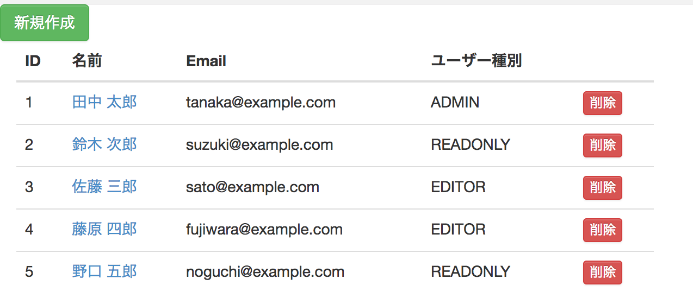
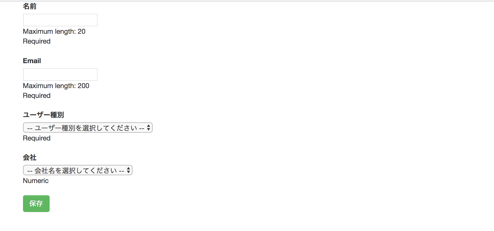
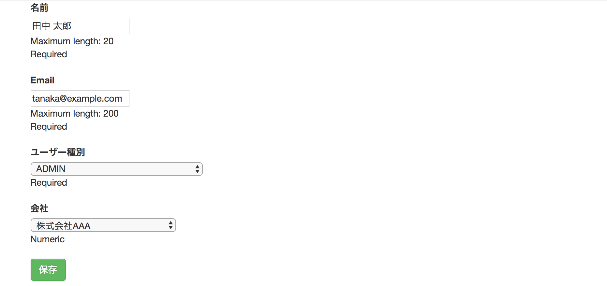
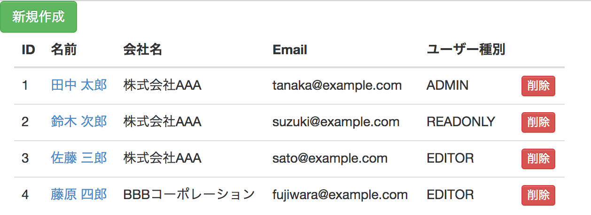
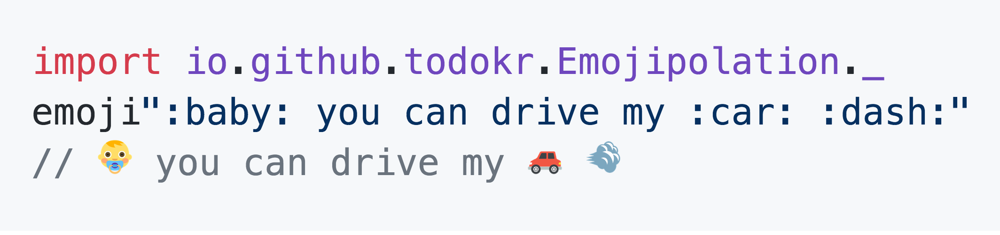

# Scala Hands-on
### 現場で活きるスキルをCRUDアプリケーション開発で学ぶ

2018.9.1  
https://gitpitch.com/todokr/20180901-scala-hands-on#/

---

# 今日のゴール

- Scala + PlayFramework + ScalikeJDBCでCRUDアプリケーションが作れるようになる

---

# 自己紹介タイム

参加者全員でお互いに自己紹介をしましょう👍

---

## 岩松 竜也

- 戦略人事を実現するHRMOS採用管理 アプリケーションエンジニア
- 2015年新卒入社
- Scala好きです😍

---

## 田所 駿佑

- 求人検索エンジン「スタンバイ」 プロダクトオーナー
- 2015年新卒入社
- PlayFramework, ScalikeJDBC コントリビューター
- 「クローリングハック」(翔泳社) 共著

---

# 自己紹介タイム

参加者全員でお互いに自己紹介をしましょう👍

- お名前を教えてください
- 普段はどんなプログラムを書いていますか？
- 好きな言語はありますか？
- 「今日はこういうことについても聴いてみたい」という要望はありますか？

---

# よろしくお願いします👍

まずはScalaの基本文法から学んでいきましょう👍

---

# Scastie

https://scastie.scala-lang.org/

---

# Scalaの基本文法について

 - printlnでHello world
 - valとvar
 - def
 - if

---

# Scala 3大マスター
Scalaの開発元であるLightbend社は、Scala初学者が最初にマスターすべきことは以下の3つであると言っています

- パターンマッチ
- コレクション操作
- ケースクラス

この3つについてがっつり学びます！

---

# 今回作るアプリケーション
ユーザ情報のCRUDを行う簡単なアプリケーションを作成します。

- ユーザ一覧を表示する
- 新規ユーザ登録を行う
- ユーザ情報を編集する
- ユーザを削除する

また、後半ではこのアプリケーションと同じCRUD処理を行うJSONベースのWeb APIも作成します。

---

# 今回作るアプリケーション


---

# WAF & DB Access

## Web Application Framework
[PlayFramework 2.6.x](https://www.playframework.com/)

## DB Access Library
[ScalikeJDBC 3.2.x](http://scalikejdbc.org/)

---

# プロジェクトの準備(1)
まずはプロジェクトを作成しましょう。
ご自身のターミナルで以下のコマンドを実行してください。

```sh
sbt new playframework/play-scala-seed.g8 --branch 2.6.x
```

---

# プロジェクトの準備(2)

プロジェクト名などを聞かれますが、今回はプロジェクト名を`play2-hands-on`とし、他の項目は初期値のままプロジェクトを作成します。

```sh
This template generates a Play Scala project

name [play-scala-seed]: play2-hands-on
organization [com.example]:
play_version [2.6.18]:
sbt_version [1.2.1]:
scalatestplusplay_version [3.1.2]:

Template applied in ./play2-hands-on
```

---

# プロジェクトの準備(3)

作成したプロジェクトのディレクトリに移動し、 `sbt` コマンドを実行し、sbtシェルを起動します。  
sbtシェルが起動したら `run` でアプリケーションを起動します。
プロジェクトの起動に必要な各種ツールやJarがダウンロードされ、アプリケーションが起動されます。

```sh
cd play2-hands-on
sbt
run
```

---

# プロジェクトの準備(4)

## POINT

- `run`で実行している間はホットデプロイが有効になっているため、ソースを修正するとすぐに変更が反映されます
- CTRL+Dで`run`での実行を終了し、sbtシェルに戻ることができます
- `run`で実行中に何度も修正を行っているとヒープが不足してプロセスが終了してしまったりエラーが出たまま応答がなくなってしまう場合があります
- プロセスが終了してしまった場合は再度`sbt`と`run`を実行してください
- 応答しなくなってしまった場合は一度ターミナルを閉じ、再度起動して`sbt`と`run`を実行してください

---

# 作成したPlayプロジェクトの確認

- ブラウザから`localhost:9000`にアクセスしてみましょう
- `Welcome to Play!` と表示されていれば準備はOKです！

---

# IntelliJにプロジェクトをインポート(1)
IntelliJでPlayプロジェクトを開発するために、まずはプロジェクトをインポートします。  
「Import Project」をクリックし、Play2プロジェクトのルートディレクトリを選択し、「Open」します。



---

# IntelliJにプロジェクトをインポート(2)
SBTプロジェクトとしてインポートします。



---

# IntelliJにプロジェクトをインポート(3)
インポートする際に以下のダイアログが表示されます。初回は「Project JDK」が未選択の状態になっているかもしれません。「New…」をクリックしてJDKがインストールされているディレクトリを選択してから「OK」をクリックしてください。



---

# IntelliJとbuild.sbt
- IntelliJはbuild.sbtの設定を元にプロジェクトをインポートします
- build.sbtを編集した場合は、 `Refresh project` でプロジェクトの再インポートを行う必要があります
- または、「Enable auto-import」を選択するとbuild.sbtを変更するたびに自動的に再インポートされるようになります

---

# build.sbtを編集してみよう
試しにbuild.sbtを編集してみましょう。
まずはMySQLのJDBCドライバを依存関係に追加してみます。
build.sbtを下記のように変更してください。

```
libraryDependencies += guice
libraryDependencies += "mysql" % "mysql-connector-java" % "5.1.47" // 追加
libraryDependencies += "org.scalatestplus.play" %% "scalatestplus-play" % "3.1.2" % Test
```

---

# build.sbtを編集してみよう
先程の例は `libraryDependencies +=` が何度も出てきました。これは下記のように書き換えることもできます。

```
libraryDependencies ++= Seq(
  guice,
  "mysql" % "mysql-connector-java" % "5.1.47",
  "org.scalatestplus.play" %% "scalatestplus-play" % "3.1.2" % Test
)

```
@[1](libraryDependencies ++= Seq({依存ライブラリをカンマ区切りで}))

---

# 早速つくりはじめよう

---

# Bootstrapを使う準備(1)
`sbt new` コマンドで作成されたプロジェクトには、デフォルトのレイアウトテンプレートとして `app/views/main.scala.html` が生成されています。ここにBootstrapで使用するCSSとJavaScriptを追加します。

```html
<link rel="stylesheet" media="screen" href="//netdna.bootstrapcdn.com/bootstrap/3.1.1/css/bootstrap-theme.min.css">
<link rel="stylesheet" media="screen" href="//netdna.bootstrapcdn.com/bootstrap/3.1.1/css/bootstrap.min.css">

<script src="//cdnjs.cloudflare.com/ajax/libs/jquery/3.3.1/jquery.min.js"></script>
<script src="//netdna.bootstrapcdn.com/bootstrap/3.1.1/js/bootstrap.min.js"></script>
```

---

# Bootstrapを使う準備(2)
追加したら `localhost:9000` をリロードしてみましょう。 JavaScriptコンソールにエラーが出ているかと思います。
これはPlayが提供している「セキュリティヘッダフィルタ」が、HTTPレスポンスに「同一生成元ではない」リソースを無効にするヘッダ(`Content-Security-Policy`)を付与しているためです。

- [Playのセキュリティヘッダフィルタについてのドキュメント](https://www.playframework.com/documentation/2.6.x/SecurityHeaders)
- [同一生成元ポリシーについて](https://developers.google.com/web/fundamentals/security/csp/)

---

# Bootstrapを使う準備(2)
CDNから配信されるリソースを利用するためには、CDNのドメインを「この配信元は信用できる」というホワイトリストに追加する必要があります。
`conf/application.conf` に下記の一行を追加します。

```
play.filters.headers.contentSecurityPolicy = "script-src 'self' netdna.bootstrapcdn.com cdnjs.cloudflare.com"
```

これでBootstrapを使う準備は完了です。

---

# Controllerの雛形を作る
ではさっそくアプリケーションを作っていきます。まずはControllerの雛形を用意します。

```scala
package controllers

import play.api.mvc._
import play.api.data._
import play.api.data.Forms._
import javax.inject.Inject

class UserController @Inject()(components: MessagesControllerComponents)
  extends MessagesAbstractController(components) {

  // 一覧画面の表示
  def list = TODO

  // 編集画面の表示
  def edit(id: Option[Long]) = TODO

  // 登録処理の実行
  def create = TODO

  // 更新処理の実行
  def update = TODO

  // 削除処理の実行
  def delete(id: Long) = TODO
}
```
@[8](PlayFrameworkではControllerをclassとして実装します)
@[8](@Injectアノテーションと2つの引数が定義されていますが、これはPlay 2.4から導入されたGoogle GuiceによるDI機能を使用するためのもの)
@[8](MessagesControllerComponents: Playの国際化機能を使用するために必要)
@[9](ControllerとなるClassは `MessagesAbstractController` を継承します)
@[12](各ActionはScalaのメソッドとして定義します)
@[12](`TODO` はPlayが提供している開発用お役立ちメソッドで、未実装なActionを表します)


---

# ルーティングの雛形を作る

クライアントから送信されたリクエストは、 `conf/routes` の設定に従ってコントローラのメソッドへルーティングされます。
以下の設定を追記します。

```
# Mapping to /user/list
GET     /user/list                  controllers.UserController.list

# Mapping to /user/edit or /user/edit?id=<number>
GET     /user/edit                  controllers.UserController.edit(id: Option[Long] ?= None)

# Mapping to /user/create
POST    /user/create                controllers.UserController.create

# Mapping to /user/update
POST    /user/update                controllers.UserController.update

# Mapping to /user/remove/<number>
POST    /user/remove/:id            controllers.UserController.remove(id: Long)
```
@[1](`#` からはじまる行はコメント)
@[2](`/user/list` へのGETリクエストは `controllers.UserController` クラスの `list` メソッドが処理する)
@[4,5](`id` というクエリパラメータを受け取る。クエリパラメータの型は `Option[Long]` で、デフォルトはNone)

---

# アクセスしてみよう
- `localhost:9000/user/list` にアクセスしてみましょう
- 未実装であることを示す紫色の画面が表示されればOKです

---

# MySQLの準備をする(1)
まずはユーザー一覧画面を実装していきましょう。しかしその前にデータベースを用意する必要があります。

---

# MySQLの準備をする(2)
今回はMySQLをDockerから使います。プロジェクトのルートディレクトリに下記のような `docker-compose.yml` を用意します。

```yaml
version: '2.0'

services:
    mysql:
        container_name: play2-hands-on_mysql
        image: mysql/mysql-server:5.7
        ports:
            - "3306:3306"
        command: [
        "mysqld",
        "--character-set-server=utf8mb4",
        "--lower_case_table_names=1",
        "--sql_mode=TRADITIONAL",
        "--explicit_defaults_for_timestamp=ON"
        ]
        environment:
            MYSQL_ALLOW_EMPTY_PASSWORD: 1
        volumes:
            - ./mysql/:/docker-entrypoint-initdb.d

```
@[6](dockerhubの公式のMySQLのイメージを使う。versionは5.7)
@[19](MySQLの初回起動時に実行するSQLを指定。この場合、 `mysql/` 以下のSQLを実行する)

---

# MySQLの準備をする(3)
次に、MySQLの初回起動時に実行するSQLを用意します。
下記のような `mysql/init.sql` というSQLファイルを作成します。

```sql
charset utf8mb4;

CREATE USER 'root'@'%' IDENTIFIED BY '';
GRANT ALL PRIVILEGES ON *.* TO 'root'@'%';

CREATE SCHEMA IF NOT EXISTS `play2_hands_on` DEFAULT CHARACTER SET utf8mb4;
USE `play2_hands_on` ;

-- -----------------------------------------------------
-- Table `COMPANY`
-- -----------------------------------------------------
CREATE TABLE IF NOT EXISTS `company` (
  `id` BIGINT NOT NULL AUTO_INCREMENT,
  `name` VARCHAR(45) NOT NULL,
  PRIMARY KEY (`id`))
ENGINE = InnoDB;

CREATE UNIQUE INDEX `id_unique` ON `company` (`id` ASC);


-- -----------------------------------------------------
-- Table `user`
-- -----------------------------------------------------
CREATE TABLE IF NOT EXISTS `user` (
  `id` BIGINT NOT NULL AUTO_INCREMENT,
  `name` VARCHAR(45) NOT NULL,
  `email` VARCHAR(255) NOT NULL,
  `authority` VARCHAR(45) NOT NULL,
  `company_id` BIGINT NOT NULL,
  PRIMARY KEY (`id`))
ENGINE = InnoDB;

CREATE UNIQUE INDEX `id_unique` ON `user` (`id` ASC);

-- -----------------------------------------------------
-- Data for table `company`
-- -----------------------------------------------------
START TRANSACTION;
INSERT INTO `company` (`id`, `name`) VALUES (1, '株式会社AAA');
INSERT INTO `company` (`id`, `name`) VALUES (2, 'BBBコーポレーション');

COMMIT;

-- -----------------------------------------------------
-- Data for table `user`
-- -----------------------------------------------------
START TRANSACTION;
INSERT INTO `user` (`id`, `name`, `email`, `authority`, `company_id`) VALUES (1, '田中 太郎', 'tanaka@example.com', 'ADMIN', 1);
INSERT INTO `user` (`id`, `name`, `email`, `authority`, `company_id`) VALUES (2, '鈴木 次郎', 'suzuki@example.com', 'READONLY', 1);
INSERT INTO `user` (`id`, `name`, `email`, `authority`, `company_id`) VALUES (3, '佐藤 三郎', 'sato@example.com', 'EDITOR', 1);
INSERT INTO `user` (`id`, `name`, `email`, `authority`, `company_id`) VALUES (4, '藤原 四郎', 'fujiwara@example.com', 'EDITOR', 2);
INSERT INTO `user` (`id`, `name`, `email`, `authority`, `company_id`) VALUES (5, '野口 五郎', 'noguchi@example.com', 'READONLY', 2);

COMMIT;
```

---

# MySQLの準備をする(4)
下記のようにSQLが叩けるようになったら準備OKです👍

```
mysql -h '127.0.0.1' -uroot -p
Enter password: (Enterを押す)

mysql> select count(*) from play2_hands_on.user;
+----------+
| count(*) |
+----------+
|        5 |
+----------+
1 row in set (0.00 sec)

```

---

# DBアクセスライブラリ「ScalikeJDBC」を導入する
MySQLの準備ができたら、次はDBアクセスライブラリであるScalikeJDBCを依存関係に追加しましょう。
`build.sbt` のlibraryDependenciesを下記のように編集してください。

```

libraryDependencies ++= Seq(
  guice,
  "mysql" % "mysql-connector-java" % "5.1.47",
  "org.scalikejdbc" %% "scalikejdbc" % "3.2.2", // 追加
  "org.scalikejdbc" %% "scalikejdbc-config" % "3.2.2", // 追加
  "org.scalikejdbc" %% "scalikejdbc-play-initializer" % "2.6.0-scalikejdbc-3.2", // 追加
  "org.scalatestplus.play" %% "scalatestplus-play" % "3.1.2" % Test
)
```

---

# Modelを自動生成する(1)
ScalikeJDBCではタイプセーフなAPIを使用するためにモデルクラスを用意する必要がありますが、ScalikeJDBCがsbtプラグインとして提供しているジェネレータを使用することでモデルクラスをDBスキーマから自動生成することができます。

まずはsbtプラグインを依存関係に追加します。  
`project/plugins.sbt` に以下の設定を追加してください。

```
libraryDependencies += "mysql" % "mysql-connector-java" % "5.1.47"
addSbtPlugin("org.scalikejdbc" %% "scalikejdbc-mapper-generator" % "3.2.2")
```

---

# Modelを自動生成する(2)

続いて、 `project/scalikejdbc.properties` というファイルを以下の内容で作成します。

```
# ---
# jdbc settings

jdbc.driver=com.mysql.jdbc.Driver
jdbc.url=jdbc:mysql://127.0.0.1:3306/play2_hands_on?useSSL=false&nullNamePatternMatchesAll=true
jdbc.username=root
jdbc.password=
jdbc.schema=

# ---
# source code generator settings

generator.packageName=models
# generator.lineBreak: LF/CRLF
generator.lineBreak=LF
# generator.template: interpolation/queryDsl
generator.template=queryDsl
# generator.testTemplate: specs2unit/specs2acceptance/ScalaTestFlatSpec
generator.testTemplate=ScalaTestFlatSpec
generator.encoding=UTF-8
# When you're using Scala 2.11 or higher, you can use case classes for 22+ columns tables
generator.caseClassOnly=true
# Set AutoSession for implicit DBSession parameter's default value
generator.defaultAutoSession=true
# Use autoConstruct macro (default: false)
generator.autoConstruct=false
# joda-time (org.joda.time.DateTime) or JSR-310 (java.time.ZonedDateTime java.time.OffsetDateTime)
generator.dateTimeClass=java.time.OffsetDateTime
```

---

# Modeを自動生成する(3)
最後に `build.sbt` に以下の記述を追加します。これでModelの自動生成を行うscalikejdbcGenタスクが使用できるようになります。

```
enablePlugins(ScalikejdbcPlugin)
```

---

# Modelを自動生成する(4)
ではコードを自動生成してみましょう。`play2-hands-on`プロジェクトのルートディレクトリで以下のコマンドを実行します。

```sh
sbt "scalikejdbcGenAll"
```

するとplay2-hands-onプロジェクトの `app/models` パッケージに `Company` と `User` の2つのモデルクラスが生成されます。

---

# DB接続の設定
`play2-hands-on` プロジェクトの `conf/application.conf` に以下の設定を追加します。  
データベースの接続情報に加え、PlayとScalikeJDBCを連携させるための設定が含まれています。

```

db.default.driver=com.mysql.jdbc.Driver
db.default.url="jdbc:mysql://127.0.0.1:3306/play2_hands_on?useSSL=false&nullNamePatternMatchesAll=true"
db.default.username=root
db.default.password=""

scalikejdbc.global.loggingSQLAndTime.enabled=true
scalikejdbc.global.loggingSQLAndTime.singleLineMode=false
scalikejdbc.global.loggingSQLAndTime.logLevel=debug
scalikejdbc.global.loggingSQLAndTime.warningEnabled=true
scalikejdbc.global.loggingSQLAndTime.warningThresholdMillis=5
scalikejdbc.global.loggingSQLAndTime.warningLogLevel=warn

play.modules.enabled += "scalikejdbc.PlayModule"
# scalikejdbc.PlayModule doesn't depend on Play's DBModule
play.modules.disabled += "play.api.db.DBModule"
```

---

# ユーザー一覧画面を実装する(1)
modelが生成できたので、ユーザー一覧画面を実装しましょう。
テンプレートはviewsパッケージに作成します。`app` ディレクトリ配下に `views.user` パッケージを作成し、以下の内容で `list.scala.html` を作成します。

```html
@* このテンプレートの引数 *@
@(users: Seq[models.User])(implicit request: RequestHeader)

  @* テンプレートで利用可能なヘルパーをインポート *@
  @import helper._

  @* main.scala.htmlを呼び出す *@
  @main("ユーザ一覧") {

    <div>
      <a href="@routes.UserController.edit()" class="btn btn-success" role="button">新規作成</a>
    </div>

    <div class="col-xs-6">
      <table class="table table-hover">
        <thead>
          <tr>
            <th>ID</th>
            <th>名前</th>
            <th>Email</th>
            <th>ユーザー種別</th>
            <th>&nbsp;</th>
          </tr>
        </thead>
        <tbody>
          @* ユーザの一覧をループで出力 *@
          @users.map { user =>
            <tr>
              <td>@user.id</td>
              <td><a href="@routes.UserController.edit(Some(user.id))">@user.name</a></td>
              <td>@user.email</td>
              <td>@user.authority</td>
              <td>@helper.form(CSRF(routes.UserController.remove(user.id))){
                <input type="submit" value="削除" class="btn btn-danger btn-xs"/>
              }
              </td>
            </tr>
          }
        </tbody>
      </table>
    </div>
  }
```
@[1](`@* ... *@`で囲まれた内容はコメントです)
@[2](テンプレートの最初にはコントローラから受け取る引数を記述します)
@[5](@importでインポート文を記述することができます。@import helper._でPlayが提供する標準ヘルパー（フォームなどを出力する関数）をインポートしています)
@[11](リンクやフォームのURLは、@routes.・・・と記述することでルーティングから生成することができます)
@[33](デフォルトでCSRFフィルタが有効になっているため、フォームの送信先はCSRF(...)で囲む必要があります)

---

# ユーザー一覧画面を実装する(2)
次はControllerです。
アプリケーションの設計としてはあまり良くありませんが、まずはControllerにすべてのロジックを書いてしまいます。

```scala
package controllers

import play.api.mvc._
import play.api.data._
import play.api.data.Forms._
import javax.inject.Inject
import scalikejdbc._ // 追加
import models._ // 追加

class UserController @Inject()(components: MessagesControllerComponents)
  extends MessagesAbstractController(components) {

  private val u = User.syntax("u")

  // 一覧画面の表示
  def list = Action { implicit request =>
    DB.readOnly { implicit session =>
      // ユーザのリストを取得
      val users = withSQL {
        select.from(User as u).orderBy(u.id.asc)
      }.map(User(u.resultName)).list.apply()

      // 一覧画面を表示
      Ok(views.html.user.list(users))
    }
  }
...
```
@[13](ScalikeJDBCのQueryDSL（SQLをタイプセーフに記述するためのDSL）を使用する際にテーブル毎に必要となるもの)
@[17](`DB.readOnly { ... }` で参照専用のセッションを取得することができます)
@[20](このコードは `SELECT * FROM USERS ORDER BY ID` というSQLと同じ意味)

---

# ユーザー一覧画面にアクセスしてみる
再度、 `http://localhost:9000/user/list` にアクセスしてみましょう。下記のように一覧画面が表示されればOKです👍



---

# ユーザー種別でフィルターしてみよう
一覧ページに、ユーザー種別でフィルターする機能を追加しましょう。  
DBのuserテーブルのAUTHORITYカラムには「ADMIN」「EDITOR」「READONLY」の3種類のユーザー種別があります。
アプリケーションを改修し、一覧画面において特定のユーザーだけを表示できるようにしてみましょう。

具体的には、
- `/user/list?authority=admin` のときは、「ADMIN」のユーザーだけの一覧を表示
- `/user/list?authority=editor` のときは、「EDITOR」のユーザーだけの一覧を表示
- `/user/list?authority=readonly` のときは、「READONLY」のユーザーだけの一覧を表示
- クエリパラメータがないときは、全ユーザー種別の一覧を表示

とします。

---

# そこでOption[String]ですよ
`?authority=XXX` のクエリパラメータはURLに含まれることもあれば、含まれないこともあります。  
ということは、「authorityの値は存在するかもしれないし、しないかもしれない」を表現する必要があるわけです。  
こういう場面では情報をOption型で表現するのが適切です👍

---

# クエリパラメータをControllerで受け取れるようにする(1)
フィルタリングを行うためには、 `http://localhost/user/list?authority=admin` の `?authority=admin` のようにクエリパラメータとして渡している情報をControllerで受け取れるようにする必要があります。
まずは `conf/route` のユーザー一覧用ルーティングを下記のように修正します。

```
# Mapping to /user/list
GET  /user/list  controllers.UserController.list(authority: Option[String] ?= None)
```

---

# クエリパラメータをControllerで受け取れるようにする(2)
続いてControllerのlistメソッドに引数ブロックを追加します。動作を見てみるためにprintlnもしてみましょう。

```scala
// 一覧画面の表示
  def list(authority: Option[String]) = Action { implicit request =>
    println("************************")
    println(authority)
    println("************************")
```

これで `?authority=XXX` とリクエストが来た場合に、Controllerで `XXX` を受け取れるようになります。

---

# 受け取ったクエリパラメータでユーザーをフィルタリングする
Controllerが受け取った `authority` がSomeなら中身の文字列を使ってフィルタリング、
Noneならフィルタリングしないそのままの結果を使うように改修してみましょう。  
ifを使うとこのようになるかと思います。

```scala
  // 一覧画面の表示
  def list(authority: Option[String]) = Action { implicit request =>

    val whereCondition: Option[SQLSyntax] = if (authority.isDefined) {
      Some(sqls"${u.authority} = ${authority.get}")
    } else None

    DB.readOnly { implicit session =>
      // ユーザのリストを取得
      val users = withSQL {
        select.from(User as u).where(whereCondition).orderBy(u.id.asc)
      }.map(User(u.resultName)).list.apply()

      // 一覧画面を表示
      Ok(views.html.user.list(users))
    }
  }
```

---

# フィルタリングされるか確認してみよう

- http://localhost:9000/user/list?authority=admin
- http://localhost:9000/user/list?authority=editor
- http://localhost:9000/user/list?authority=readonly

---

# フィルタリング処理をリファクタしてみよう
`Option#get` はNoneに対して呼んでしまうと `java.util.NoSuchElementException` の例外が発生します。Noneに対するgetのエラーはコンパイル時に発見できないため、なるべく避けるのがScalaらしいスタイルです。  
今回は `Option#map` を使ってgetを撲滅してみましょう。

```scala
val where: Option[SQLSyntax] = authority.map(a => sqls"${u.authority} = $a")
```

---

# ユーザ登録・編集画面の実装
リクエストURLのクエリパラメータにユーザーIDが指定されているかどうかに応じて以下の処理を行います。

- `/user/edit` ⇒ 新規登録画面を表示します。
- `/user/edit?id=XXX` ⇒ USERSテーブルを検索し、該当のユーザ情報を初期表示した編集画面を表示します。

---

# Formの実装
画面からの入力値を受け取るための `Form` を定義します。Formは必ずしもコントローラに定義する必要はないのですが、コントローラでの処理に強く依存するため特に理由がない限りコントローラクラスのコンパニオンオブジェクトに定義するとよいでしょう。

ここでは `UserController` と同じソースファイルに以下のようなコンパニオンオブジェクトを追加します。

```
object UserController {
  // フォームの値を格納するケースクラス
  case class UserForm(id: Option[Long], name: String, email: String, authority: String, companyId: Long)

  // formから送信されたデータ ⇔ ケースクラスの変換を行う
  val userForm = Form(
    mapping(
      "id"        -> optional(longNumber),
      "name"      -> nonEmptyText(maxLength = 20),
      "email"          -> nonEmptyText(maxLength = 200),
      "authority"      -> nonEmptyText,
      "companyId" -> longNumber
    )(UserForm.apply)(UserForm.unapply)
  )

  // 併せて選択できるユーザー種別も定義します
  val authorities = Set("ADMIN", "EDITOR", "READONLY")
}

```

---

# コンパニオンオブジェクト

- classやtraitと同じファイル内に同じ名前で定義されたobjectのこと
- コンパニオンオブジェクトと対応するclassやtraitは互いにprivateなメンバーにアクセスできる
- classやtraitで使用する共通的なメソッドやクラス等を括り出したりするのに使う

---

# Viewの実装
続いて `views.user` パッケージに `edit.scala.html` を実装します。引数にはFormのインスタンスと、プルダウンで選択する会社情報を格納した `Seq`、選択できるユーザー種別格納した `Seq` を受け取ります。

```html
@(userForm: Form[controllers.UserController.UserForm],
  companies: Seq[models.Company],
  authorities: Set[String]
)(implicit request: MessagesRequestHeader)

@import helper._

@main("ユーザ作成") {

  @* IDがある場合は更新処理、ない場合は登録処理を呼ぶ *@
  @form(CSRF(userForm("id").value.map(x => routes.UserController.update).getOrElse(routes.UserController.create)), 'class -> "container", 'role -> "form") {
    <fieldset>
      <div class="form-group">
      @inputText(userForm("name"), '_label -> "名前")
      </div>
      <div class="form-group">
      @inputText(userForm("email"), '_label -> "Email")
      </div>
      <div class="form-group">
      @select(userForm("authority"), authorities.map(x => x -> x).toSeq, '_label -> "ユーザー種別", '_default -> "-- ユーザー種別を選択してください --")
      </div>
      <div class="form-group">
      @select(userForm("companyId"), companies.map(x => x.id.toString -> x.name), '_label -> "会社", '_default -> "-- 会社名を選択してください --")
      </div>
      @* IDがある場合（更新の場合）のみhiddenを出力する *@
      @userForm("id").value.map { value =>
        <input type="hidden" name="id" value="@value" />
      }
      <div>
        <input type="submit" value="保存" class="btn btn-success">
      </div>
    </fieldset>
  }
}
```

---

# Controllerの実装
最後にUserControllerの `edit` メソッドを実装します。引数idが指定されていた場合は空のForm、指定されていた場合は `Form#fill` メソッドでFormに初期表示する値をセットしたうえでテンプレートを呼び出すようにします。


```scala
class UserController @Inject()(components: MessagesControllerComponents)
  extends MessagesAbstractController(components) {

  import UserController._ // 追加

  private val u = User.syntax("u")
  private val c = Company.syntax("c") // 追加

(中略)

  // 編集画面の表示
  def edit(id: Option[Long]) = Action { implicit request =>
    DB.readOnly { implicit session =>
      val form = id match {
        // IDが渡されなかった場合は新規登録フォーム
        case None => userForm
        // IDからユーザ情報を1件取得してフォームに詰める
        case Some(id) => User.find(id) match {
          case Some(user) => userForm.fill(UserForm(Some(user.id), user.name, user.email, user.authority, user.companyId))
          case None => userForm
        }
      }

      // プルダウンに表示する会社のリストを取得
      val companies = withSQL {
        select.from(Company as c).orderBy(c.id.asc)
      }.map(Company(c.resultName)).list().apply()

      Ok(views.html.user.edit(form, companies, authorities))
    }
  }
```
@[16](idが指定されていなかった場合（Noneの場合）は新規登録用の空フォーム)
@[18~21](idが指定されていた場合（Some(id)の場合）は更新用フォームを生成)
@[25~27](`User.find(...)で更新用フォームに設定するためのユーザ情報をDBから取得)

---

# 自動生成されたメソッドとQueryDSL

`User.find(...)` はscalikejdbcGenで自動生成された検索用メソッドです。このような基本的なCRUD処理はQueryDSLを使わなくても自動生成されたメソッドで実装することができます。

ちなみにこのメソッドをQueryDSLで書き直すと以下のようになります。

```scala
// 1件検索をQueryDSLで書き直した場合
withSQL {
  select.from(User as u).where.eq(u.id, id)
}.map(User(u.resultName)).single.apply()
```

---

# ブラウザから確認
ここまで実装したらブラウザで一覧画面から新規作成やユーザ名のリンクをクリックし、登録画面と編集画面が表示されることを確認します。




---

# 登録・更新処理の実装

入力値のバリデーションを行い、エラーの有無に応じて以下の処理を行います。

- エラーあり ⇒ フォームにエラー情報をセットして入力フォームに戻ります。
- エラーなし ⇒ DBへの登録・更新処理を行い、一覧画面へリダイレクトします。

---

# Controllerの実装(1)
`UserController` のメソッドのうち、登録処理を行う `create` メソッドと更新処理を行う `update` メソッドを実装します。

入力フォームの値を受け取るには、 `userForm.bindFromRequest` メソッドでリクエストの内容をFormにバインドし、 `fold` メソッドでエラーがあった場合の処理と、OKの場合の処理を記述します。以下はcreateメソッドの実装例です。

```scala
 // 登録処理の実行
  def create = Action { implicit request =>
    DB.localTx { implicit session =>
      // リクエストの内容をバインド
      userForm.bindFromRequest.fold(
        // エラーの場合
        error => {
          BadRequest(views.html.user.edit(error, Company.findAll(), authorities))
        },
        // OKの場合
        form  => {
          // ユーザを登録
          User.create(form.name, form.email, form.authority, form.companyId)
          // 一覧画面へリダイレクト
          Redirect(routes.UserController.list(None))
        }
      )
    }
  }
```
@[3](`DB.localTx { ... }`でトランザクション管理されたセッションを取得することができます)
@[3](この中の処理が正常に終了した場合はコミットされ、例外が発生した場合は自動的にロールバックされます)
@[13](User.create()はscalikejdbcGenによって自動生成されたメソッドで、INSERTにあたります)

---

# Controllerの実装(2)
`update` メソッドも同じように実装します。

```scala
  // 更新処理の実行
  def update = Action { implicit request =>
    DB.localTx { implicit session =>
      // リクエストの内容をバインド
      userForm.bindFromRequest.fold(
        // エラーの場合は編集画面に戻す
        error => {
          BadRequest(views.html.user.edit(error, Company.findAll(), authorities))
        },
        // OKの場合は更新を行い一覧画面にリダイレクトする
        form => {
          // ユーザ情報を更新
          User.find(form.id.get).foreach { user =>
            User.save(user.copy(name = form.name, email = form.email, authority = form.authority, companyId = form.companyId))
          }
          // 一覧画面にリダイレクト
          Redirect(routes.UserController.list(None))
        }
      )
    }
  }
```
@[13](User.save()はscalikejdbcGenによって自動生成されたメソッドで、UPDATEにあたります)

---

# (参考) INSERTとUPDATEをQueryDSLで書いてみる
INSERTに対応するUser.create()や、UPDATEに対応するUser.save()など、ここでもscalikejdbcGenによって自動生成されたメソッドを使用していますが、これらをQueryDSLを使って書き直すと以下のようになります。

```scala
// INSERTをQueryDSLで書き直した場合
val generatedKey = withSQL {
  insert.into(User).namedValues(
    u.name -> form.name,
    u.email -> form.email,
    u.authoity -> form.authority,
    u.companyId -> form.companyId
  )
}.updateAndReturnGeneratedKey.apply()

// UPDATEをQueryDSLで書き直した場合
 withSQL {
  QueryDSL.update(User).set(
    u.name -> form.name,
    u.email -> form.email,
    u.authoity -> form.authority,
    u.companyId -> form.companyId
  ).where.eq(u.id, form.id)
}.update.apply()
```

---

# 動作を確認してみよう
ここまで実装したら、登録画面や編集画面からユーザ情報の登録、編集を行えることを確認しましょう。  
ユーザ名を空欄や20文字以上で登録しようとするとエラーメッセージが表示され、バリデーションが効いていることも確認できるはずです。

---

# 削除処理の実装
指定したIDのユーザをUSERSテーブルから削除し、一覧画面へリダイレクトします。

---

# Controllerの実装
すでに一覧画面に「削除」ボタンは表示されているので、そこから呼び出されるコントローラのメソッドのみ実装します。

```scala
  // 削除処理の実行
  def remove(id: Long) = Action { implicit request =>
    // ユーザーの削除
    User.find(id).foreach(user => User.destroy(user))

    // 一覧画面へリダイレクト
    Redirect(routes.UserController.list(None))
  }
```
@[4](`User.destroy()` もscalikejdbcGenで自動生成されたメソッドです)

---

# (参考) DELETEをQueryDSLで書き直す
`User.destroy()` をQueryDSLで書き直すと以下のようになります。

```scala
withSQL {
  delete.from(User).where.eq(u.id, id)
}.update.apply()
```

---

# 動作を確認する
一覧画面から「削除」をクリックしてユーザ情報が削除されることを確認してみましょう。

---

# ScalikeJDBでJOINする
ここまではscalikejdbcGenで自動生成されたメソッドやシンプルなQueryDSLを使用してきましたが、テーブルのジョインが必要なケースについても実装してみましょう。

ユーザの一覧画面に以下のように会社名を表示するようにしてみます。



---

# Controllerの修正
まずはUserControllerのlistメソッドを以下のように修正します。

```scala
  // 一覧画面の表示
  def list(authority: Option[String]) = Action { implicit request =>

    val where: Option[SQLSyntax] = authority.map(a => sqls"${u.authority} = $a")

    DB.readOnly { implicit session =>
      // ユーザのリストを取得
      val users = withSQL {
        select
          .from(User as u).leftJoin(Company as c).on(u.companyId, c.id)
          .where(where)
          .orderBy(u.id.asc)
      }.map { rs =>
        (
          User(u)(rs),
          rs.intOpt(c.resultName.id).map(_ => Company(c)(rs))
        )
      }.list.apply()

      // 一覧画面を表示
      Ok(views.html.user.list(users))
    }
  }
```
@[10](`leftJoin` と `on` メソッドでuserテーブルとcompanyテーブルを外部結合)
@[15](`User(u)(rs)` で結果セットをUserクラスをマッピング)
@[16](外部結合したテーブルの値を取得する場合、map()メソッドでOption型に変換する必要があるという点に注意)
@[16](結果セットからcompanyテーブルのIDカラムをintOptメソッドでOption[Int]型として取得し、値が取得できた場合のみCompanyクラスにマッピング)

---

# Viewの修正
続いて `list.scala.html` を以下のように修正します。検索結果の型が `Seq[User]` から `Seq[(User, Option[Company])]` に変わり、表に「会社名」という列を追加しています。

```scala
@* このテンプレートの引数 *@
@(users: Seq[(models.User, Option[models.Company])])(implicit request: RequestHeader)

  @* テンプレートで利用可能なヘルパーをインポート *@
  @import helper._

  @* main.scala.htmlを呼び出す *@
  @main("ユーザ一覧") {

    <div>
      <a href="@routes.UserController.edit()" class="btn btn-success" role="button">新規作成</a>
    </div>

    <div class="col-xs-6">
      <table class="table table-hover">
        <thead>
          <tr>
            <th>ID</th>
            <th>名前</th>
            <th>会社名</th>
            <th>Email</th>
            <th>ユーザー種別</th>
            <th>&nbsp;</th>
          </tr>
        </thead>
        <tbody>
          @* ユーザの一覧をループで出力 *@
          @users.map { case (user, company) =>
            <tr>
              <td>@user.id</td>
              <td><a href="@routes.UserController.edit(Some(user.id))">@user.name</a></td>
              <td>@company.map(_.name)</td>
              <td>@user.email</td>
              <td>@user.authority</td>
              <td>@helper.form(CSRF(routes.UserController.remove(user.id))){
                <input type="submit" value="削除" class="btn btn-danger btn-xs"/>
              }
              </td>
            </tr>
          }
        </tbody>
      </table>
    </div>
  }
```
@[20](「会社名」カラムを追加)
@[28](`map` の引数内でcase句を使いたタプルを分解（後ほど解説します）)
@[34](会社名が存在すればそれを表示する)

---

# case句を用いたタプルの分解
タプルの内容には、 `._1` など添字でアクセスすることもできますが、これはバグの元になりやすいという欠点があります。  

```scala
val children = Seq(("taro", 12), ("jiro", 10))
val text = children.map(x => s"${x._1}さんは${x._2}歳です")
```

---

# case句を用いたタプルの分解
`case` 句を使って構造を分解することで変数に束縛し、名前つきで扱えるようにするというテクニックがあります。

```scala
val children = Seq(("taro", 12), ("jiro", 10))
val text = children.map { (name, age) => s"${name}さんは${age}歳です" }
```

---

# 動作確認
ユーザー一覧画面にアクセスすると、会社名の欄が追加できていることが確認できるはずです👍

---

# (番外編) ScalikeJDBCでSQLを直接記述する
ここではタイプセーフなDSLを使ったJOINを使用しましたが、集計処理など少し複雑な操作が必要な場合はSQLを直接記述したいことがあります。

---

# (番外編) ScalikeJDBCでSQLを直接記述する
`sql` interpolationを使うと文字列リテラルで生SQLを記述することができます。  
ただし、SQLを完全に記述するだけでなく、自動生成されたクラスを使って記述を補助することができます。

```scala
val users: Seq[(Users, Companies)] = sql"""
  |SELECT ${u.result.*}, ${c.result.*}
  |FROM ${Users.as(u)} INNER JOIN ${Companies.as(c)}
  |ON ${u.companyId} = ${c.id}
""".stripMargin.map { rs =>
  (Users(u)(rs), Companies(c)(rs))
}.list.apply()
```

SELECT句に大量のカラムを記述する必要がなかったり、テーブル名やカラム名のタイプミスを防ぐことができます。また、sql interpolationを使う場合はwithSQL { ... }で囲む必要はありません。map()メソッド以降はQueryDSLの場合と同じです。

---

# (宣伝) Emojipolation
`emoji` interpolationのためのライブラリを以前作ったので、もし興味があれば...😇



https://github.com/todokr/emojipolation

---

# JSON APIをつくる
フロントエンドがAngularJSやスマートフォンアプリの場合、サーバサイドはJSONを返却するAPIを提供する必要があります。  
ここまでに作成してきたユーザ情報のCRUD処理について、Play2のJSONサポート機能を使ってJSONベースのWeb APIを実装します。

---

# Controllerwの実装
controllersパッケージに `JsonController` クラスを以下の内容で作成します。ScalikeJDBCやPlay2のJSONサポートを使用するためのimport文を予め含めています。

```scala
package controllers

import play.api.mvc._
import play.api.libs.json._
import play.api.libs.functional.syntax._
import javax.inject.Inject
import scalikejdbc._
import models._

class JsonController @Inject()(components: ControllerComponents)
  extends AbstractController(components) {

  //一覧表示
  def list = TODO

  // ユーザ登録
  def create = TODO

  // ユーザ更新
  def update = TODO

  // ユーザ削除
  def remove(id: Long) = TODO
}
```
@[4](`play.api.libs.json._` はPlay2のJSONサポート機能を使用するために必要なimport文です)

---

# ルーティングの設定

`conf/routes` に以下の内容を追記します。

```
# JSON API
GET         /json/list              controllers.JsonController.list
POST        /json/create            controllers.JsonController.create
POST        /json/update            controllers.JsonController.update
POST        /json/remove/:id        controllers.JsonController.remove(id: Long)
```

---

# ユーザー一覧APIの実装
`user` テーブルからIDの昇順に全件取得し、ユーザ一覧をJSONで返します。

---

# Writesの定義
Play2のJSONサポートでは、ScalaオブジェクトをJSONに変換するためのWrites、JSONをScalaオブジェクトに変換するためのReadsを定義する必要があります。

- Writes: Scala → JSON
- Reads: JSON → Scala

---

# Writesの定義
今回は「userテーブルを検索して取得したケースクラスのリスト」をJSONに変換して返却するので、userテーブルのUserクラスに対応するWritesを定義します。  
画面から値を受け取るFormと同様、該当のコントローラ（ここではJsonController）のコンパニオンオブジェクトとして以下の内容を追加します。

```scala
object JsonController {
  // UsersをJSONに変換するためのWritesを定義
  implicit val userWrites: Writes[User] = (
    (__ \ "id"       ).write[Long]   and
    (__ \ "name"     ).write[String] and
    (__ \ "email"    ).write[String] and
    (__ \ "authority").write[String] and
    (__ \ "companyId").write[Long]
  )(unlift(User.unapply))
}
```

---

# Controllerの実装
`JsonController` の `list` メソッドを以下のように実装します。

```scala
// コンパニオンオブジェクトに定義したReads、Writesを参照するためにimport文を追加
import JsonController._

def list = Action { implicit request =>
  val u = Users.syntax("u")

  DB.readOnly { implicit session =>
    // ユーザのリストを取得
    val users = withSQL {
      select.from(Users as u).orderBy(u.id.asc)
    }.map(Users(u.resultName)).list.apply()

    // ユーザの一覧をJSONで返す
    Ok(Json.obj("users" -> users))
  }
}
```
@[14](`Json.obj` メソッドでケースクラスからJSONへの変換が行われますが、このときにケースクラスに対応したWritesが定義されていないとコンパイルエラー)

---

# 動作確認してみる
ターミナルから `curl` コマンドを叩いて結果を確認してみましょう。

```sh
curl -XGET http://localhost:9000/json/list
```

下記のような結果が返ってくればOKです。

```json
{"users":[{"id":1,"name":"田中 太郎","email":"tanaka@example.com","authority":"ADMIN","companyId":1},{"id":2,"name":"鈴木 次郎","email":"suzuki@example.com","authority":"READONLY","companyId":1},{"id":3,"name":"佐藤 三郎","email":"sato@example.com","authority":"EDITOR","companyId":1},{"id":4,"name":"藤原 四郎","email":"fujiwara@example.com","authority":"EDITOR","companyId":2}]}
```

---

# ユーザ登録・更新APIの実装
ユーザ情報をJSONで受け取り、登録もしくは更新を行います。

---

# Readsの定義
`JsonController` のコンパニオンオブジェクトにユーザー情報を受け取るためのケースクラスと、JSONからそのケースクラスに変換するためのReadsを定義します。

```scala
object JsonController {
  ...

  // ユーザ情報を受け取るためのケースクラス
  case class UserForm(id: Option[Long], name: String, email: String, authority: String, companyId: Option[Int])

  // JSONをUserFormに変換するためのReadsを定義
  implicit val userFormReads = (
    (__ \ "id"       ).readNullable[Long] and
    (__ \ "name"     ).read[String]       and
    (__ \ "email"    ).read[String]       and
    (__ \ "authority").read[String]       and
    (__ \ "companyId").readNullable[Long]
  )(UserForm)
}
```

---

# Controllerの実装(1)
JsonControllerのcreateメソッドを以下のように実装します。  
JSONリクエストを受け取る場合は `Action(parse.json) { ... } ` のようにアクションにparse.jsonを指定します。  `request.body.validate` メソッドでJSONをケースクラスに変換でき、変換に失敗した場合の処理を `recoverTotal` メソッドで行うことができます。

```scala
def create = Action(parse.json) { implicit request =>
  request.body.validate[UserForm].map { form =>
    // OKの場合はユーザを登録
    DB.localTx { implicit session =>
      User.create(form.name, form.email, form.authority, form.companyId)
      Ok(Json.obj("result" -> "success"))
    }
  }.recoverTotal { e =>
    // NGの場合はバリデーションエラーを返す
    BadRequest(Json.obj("result" -> "failure", "error" -> JsError.toJson(e)))
  }
}
```

---

# Controllerの実装(2)
同様に `update` メソッドを以下のように実装します。

```scala
def update = Action(parse.json) { implicit request =>
  request.body.validate[UserForm].map { form =>
    // OKの場合はユーザ情報を更新
    DB.localTx { implicit session =>
      User.find(form.id.get).foreach { user =>
        User.save(user.copy(name = form.name, email = form.email, authority = form.authority, companyId = form.companyId))
      }
      Ok(Json.obj("result" -> "success"))
    }
  }.recoverTotal { e =>
    // NGの場合はバリデーションエラーを返す
    BadRequest(Json.obj("result" -> "failure", "error" -> JsError.toJson(e)))
  }
}
```
@[1](`parse.json` はボディパーサと呼ばれるもので、リクエストボディの処理方法を決めるものです)

---

# 動作確認(1)
コマンドラインから以下のコマンドを実行してユーザ情報を登録・更新できることを確認しましょう。

### 登録

```sh
curl -H "Content-type: application/json" -XPOST -d '{"name":"TestUser", "email": "test@example.com", "authority": "EDITOR", "companyId":1}' http://localhost:9000/json/create
```

### 更新

```sh
curl -H "Content-type: application/json" -XPOST -d '{"id": 1, "name":"UpdatedUser", "email": "test@example.com", "authority": "EDITOR", "companyId":1}' http://localhost:9000/json/update
```

---

# 動作確認(2)
エラー時のレスポンスを確認するために、以下のように不正なJSONを送信してみましょう（プロパティ名がnameではなくuserNameになっている）。

```sh
curl -H "Content-type: application/json" -XPOST -d '{"userName":"TestUser", "email": "test@example.com", "authority": "EDITOR", "companyId":1}' http://localhost:9000/json/create
```

---

# ユーザ削除APIの実装
指定したIDのユーザを `user` テーブルから削除します。

# Controllerの実装

`JsonController` の `remove` メソッドを以下のように実装します。

```scala
def remove(id: Long) = Action { implicit request =>
  DB.localTx { implicit session =>
    // ユーザを削除
    User.find(id).foreach { user =>
      User.destroy(user)
    }
    Ok(Json.obj("result" -> "success"))
  }
}
```

---

# 動作確認
ターミナルから以下のコマンドを実行してユーザが削除されることを確認してください。

```sh
curl -XPOST http://localhost:9000/json/remove/1
```